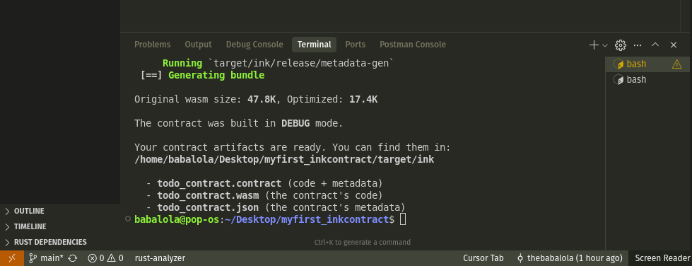

# Simple Todo Contract

A simple smart contract built with ink! for managing todo tasks on the blockchain. This contract implements standard CRUD (Create, Read, Update, Delete) operations for task management.

## Features

- ✅ **Create Tasks**: Add new todo items with descriptions
- ✅ **Read Tasks**: Retrieve single or all tasks
- ✅ **Update Tasks**: Modify task descriptions
- ✅ **Delete Tasks**: Remove tasks from the list
- ✅ **Mark Complete**: Toggle task completion status
- ✅ **Events**: Blockchain events for all operations
- ✅ **Topics**: Indexed event topics for efficient filtering

## Contract Structure

### Events
- `TaskCreated` - Emitted when a new task is added
- `TaskCompleted` - Emitted when a task is marked complete
- `TaskRemoved` - Emitted when a task is deleted
- `TaskUpdated` - Emitted when a task description is updated

### Methods
- `new()` - Constructor to initialize the contract
- `add_task(description)` - Create a new task
- `get_task(id)` - Get a specific task by ID
- `get_tasks()` - Get all tasks
- `update_task(id, description)` - Update a task description
- `complete_task(id)` - Mark a task as complete
- `remove_task(id)` - Delete a task

## Build Status



## Getting Started

### Prerequisites
- Rust toolchain
- ink! development environment

### Building the Contract

```bash
# Check if the contract compiles
cargo check

# Build the contract
cargo contract build
```

### Testing

```bash
# Run tests
cargo test
```

## Contract Details

- **Language**: Rust
- **Framework**: ink! v5.1.1
- **Features**: Events, Topics, CRUD Operations
- **Storage**: Vec-based task storage with auto-incrementing IDs

## License

This project is open source and available under the MIT License.
